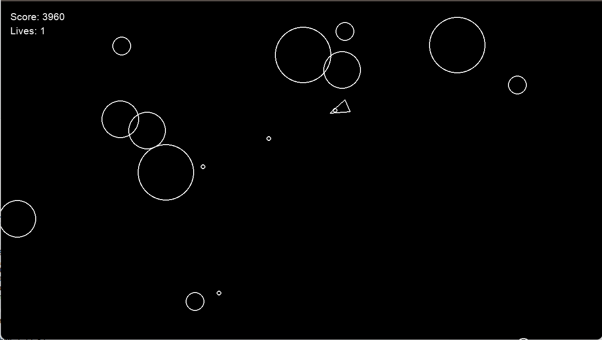

# Basic asteroids game

> Written as guided project

Launch: `python3 main.py`

**Possible extentions of project:**

* [X]  Add a scoring system
* [X]  Implement multiple lives and respawning
* [X]  Add 'Game Over' screen
* [X]  Add an explosion effect for the asteroids
* [ ]  Add acceleration to the player movement
* [ ]  Make the objects wrap around the screen instead of disappearing
* [ ]  Add a background image
* [ ]  Create different weapon types
* [ ]  Make the asteroids lumpy instead of perfectly round
* [ ]  Make the ship have a triangular hit box instead of a circular one
* [ ]  Add a shield power-up
* [ ]  Add a speed power-up
* [ ]  Add bombs that can be dropped

